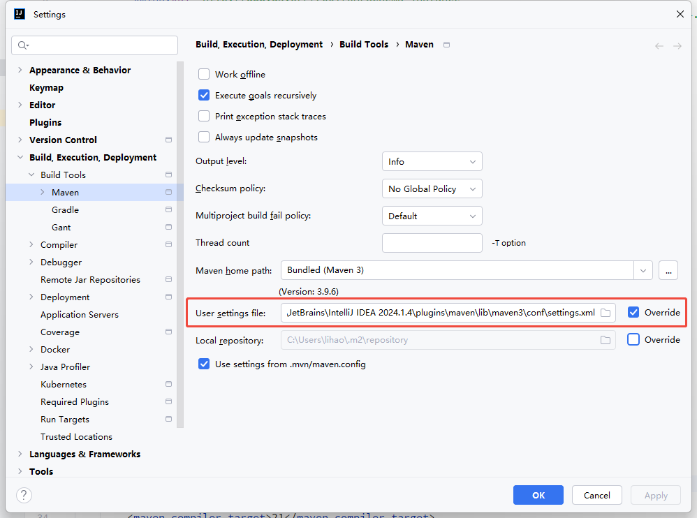
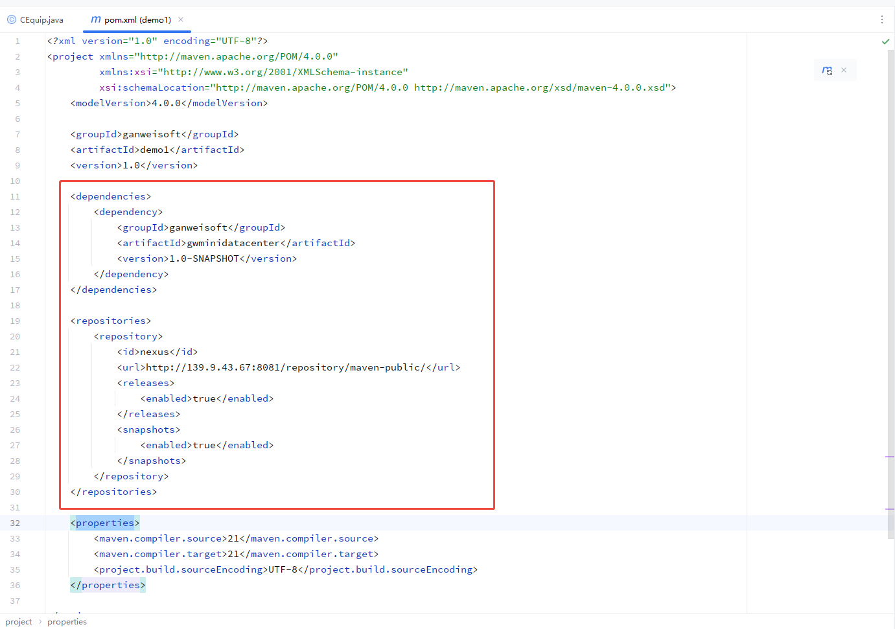
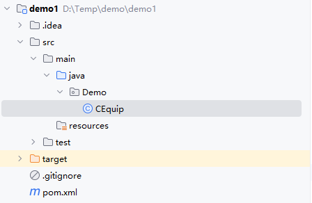
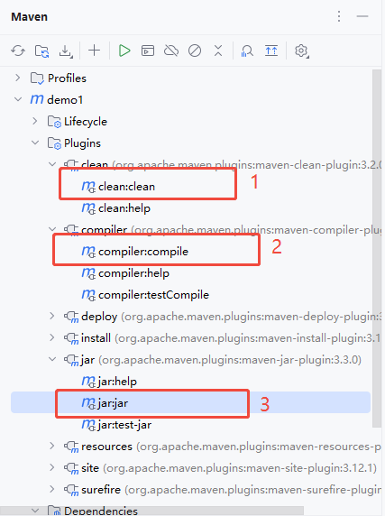
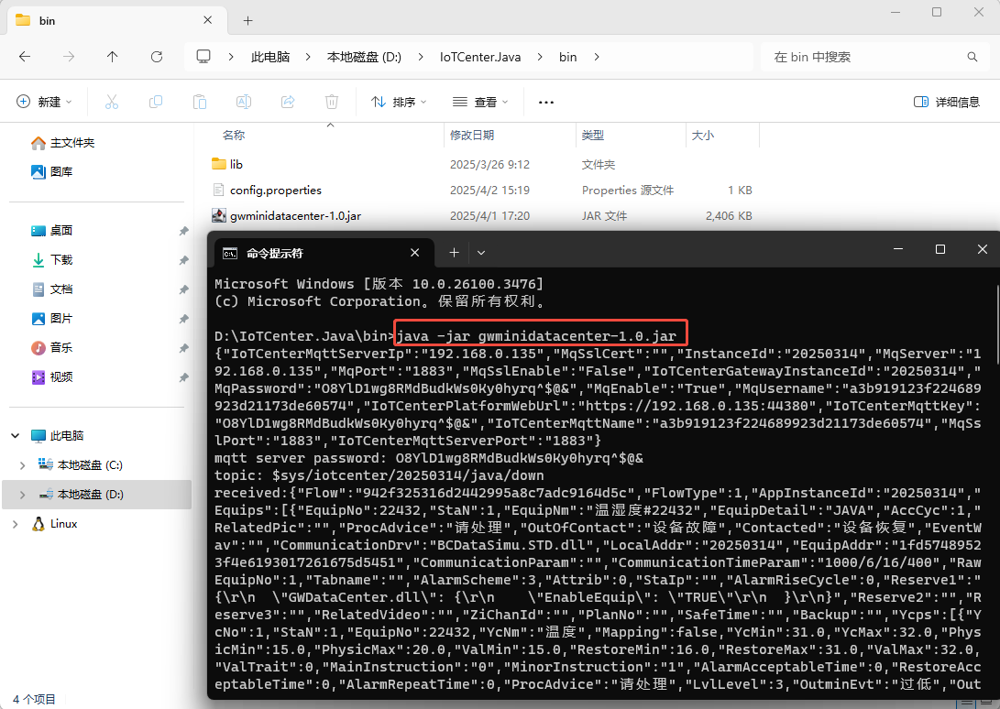

# Development Guide

## 前置条件

1、JDK版本，使用微软的openJDK21.下载地址：https://learn.microsoft.com/zh-cn/java/openjdk/download


## maven设置

**Maven是一个基于Java的项目管理工具（POM项目对象模型），它可以帮助开发人员自动化构建、测试和部署Java项目**

在maven安装目录的setting.xml文件中增加如下配置。（需预先安装maven）

**注：如果是使用的jetbrain idea作为开发工具，无需再单独安装maven。setting.xml位于idea的安装目录：IntelliJ IDEA\plugins\maven\lib\maven3\conf**

**注意：需管理员权限才能修改当前文件**

```

<!--在servers节点下-->
<server>
    <id>ganweisoft</id>
    <username>ganweimaven</username>
    <password>ganwei2025</password>
</server>


<!--在mirrors节点下-->
<mirror>
    <id>ganweisoft</id>
    <name>ganweisoft repository</name>
    <url>https://nuget.ganweicloud.com/maven/maven-public/</url>
    <mirrorOf>*</mirrorOf>
</mirror>

<!--在profiles节点下-->
<profile>
    <id>ganweisoft</id>
    <repositories>
        <repository>
            <id>ganweisoft</id>
            <url>https://nuget.ganweicloud.com/maven/maven-public/</url>
            <releases>
                <enabled>true</enabled>
            </releases>
            <snapshots>
                <enabled>true</enabled>
            </snapshots>
        </repository>
    </repositories>
    <pluginRepositories>
        <pluginRepository>
            <id>public</id>
            <name>Public Repositories</name>
            <url>https://nuget.ganweicloud.com/maven/maven-public/</url>
            <releases>
                <enabled>true</enabled>
            </releases>
            <snapshots>
                <enabled>true</enabled>
            </snapshots>
        </pluginRepository>
    </pluginRepositories>
</profile>

<!--在activeProfiles节点下-->
  <activeProfiles>
    <activeProfile>ganweisoft</activeProfile>
  </activeProfiles>

```

## 项目设置

1、创建一个maven项目，项目设置使用已配置好的maven配置setting.xml



2、导入依赖。在项目的pom.xml文件增加如下节点
```
<!--在dependencies节点下-->
<dependencies>
    <dependency>
        <groupId>ganweisoft</groupId>
        <artifactId>gwminidatacenter</artifactId>
        <version>1.0</version>
    </dependency>
</dependencies>

<!--在repositories节点下-->
<repositories>
    <repository>
        <id>nexus</id>
        <url>https://nuget.ganweicloud.com/maven/maven-public/</url>
        <releases>
            <enabled>true</enabled>
        </releases>
        <snapshots>
            <enabled>true</enabled>
        </snapshots>
    </repository>
</repositories>

```


3、**必须：在包里增加一个CEquip的Java类。gwminidatacenter会根据类名CEquip找寻加载入口**



4、随机数代码示例

```
package ganweisoft;

import gwdatacenter.*;
import gwdatacenter.database.*;

import java.util.Random;


public class CEquip extends CEquipBase
{
    public CEquip() {
        // 初始化代码（如果有需要）
    }

    /**
     获取设备数据

     @return
     */
    private int iCounttemp = 0;
    @Override
    public CommunicationState GetData(CEquipBase pEquip)
    {
        Sleep(1000);
        if (super.getRunSetParmFlag())
        {
            return CommunicationState.setreturn;
        }

        CommunicationState commState = super.GetData(pEquip);
        if (!commState.equals(CommunicationState.ok))
        {
            return CommunicationState.ok;
        }

        if (!pEquip.GetEvent())
        {
            return CommunicationState.fail;
        }
        return CommunicationState.ok;
    }

    @Override
    public boolean GetYC(YcpTableRow r)
    {
        super.SetYCData(r, new Random().nextDouble());
        return true;
    }

    @Override
    public boolean GetYX(YxpTableRow r)
    {
        super.SetYXData(r, new Random().nextBoolean());
        return true;
    }

    //模拟一些数据
    @Override
    public boolean SetParm(String MainInstruct, String MinorInstruct, String Value)
    {
        try
        {
            if (MainInstruct.equalsIgnoreCase("SetYCYXValue")) //可以强制设置YCYX的值
            {
                if (MinorInstruct.length() > 2) //e.g. MinorInstruct=C_2 0r X_15
                {
                    if (sharpSystem.StringHelper.isNullOrEmpty(Value))
                    {
                        return false;
                    }
                    int ycyxno = Integer.parseInt(MinorInstruct.substring(2));
                    if (ycyxno > 0)
                    {
                        if (MinorInstruct.charAt(0) == 'C' || MinorInstruct.charAt(0) == 'c') //表示设置YC值
                        {
                            getYCResults().put(ycyxno, Double.parseDouble(Value));
                            return true;
                        }
                        if (MinorInstruct.charAt(0) == 'X' || MinorInstruct.charAt(0) == 'x') //表示设置YX值
                        {
                            getYXResults().put(ycyxno, Integer.parseInt(Value) > 0);
                            return true;
                        }
                    }
                }
            }

            return false;
        }
        catch (RuntimeException e)
        {
            DataCenter.WriteLogFile(e.toString());
            return false;
        }
    }
}
```

5、编译，打包  

右击选择 运行Maven构建



**可选：已安装Maven时运行下述命令行语句**

```
mvn clean compile jar:jar
```

## 运行java 程序

将打包输出的jar文件替换到下列目录下的dll目录里面

1、目录层级

```
+---bin
|   |   gwminidatacenter-1.0.jar
|   \---lib
|           comm-1.0.0.jar
|           jackson-annotations-2.13.5.jar
|           jackson-core-2.13.5.jar
|           jackson-databind-2.13.5.jar
|           jackson-dataformat-xml-2.13.5.jar
|           jackson-datatype-jdk8-2.13.5.jar
|           jackson-datatype-jsr310-2.13.5.jar
|           org.eclipse.paho.client.mqttv3-1.2.5.jar
|           stax2-api-4.2.1.jar
|           woodstox-core-6.4.0.jar
|
+---dll
|       BCDataSimu.STD.jar
|
\---log
        XLog.txt

```

2、在bin目录下执行命令（附上截图）



```
java -jar gwminidatacenter-1.0.jar
```

**注：一般情况下需要使用环境变量，此时可使用set（windows）或者export（Linux）先初始化后，再调用运行命令**

```
set InstanceId=20250304
```
