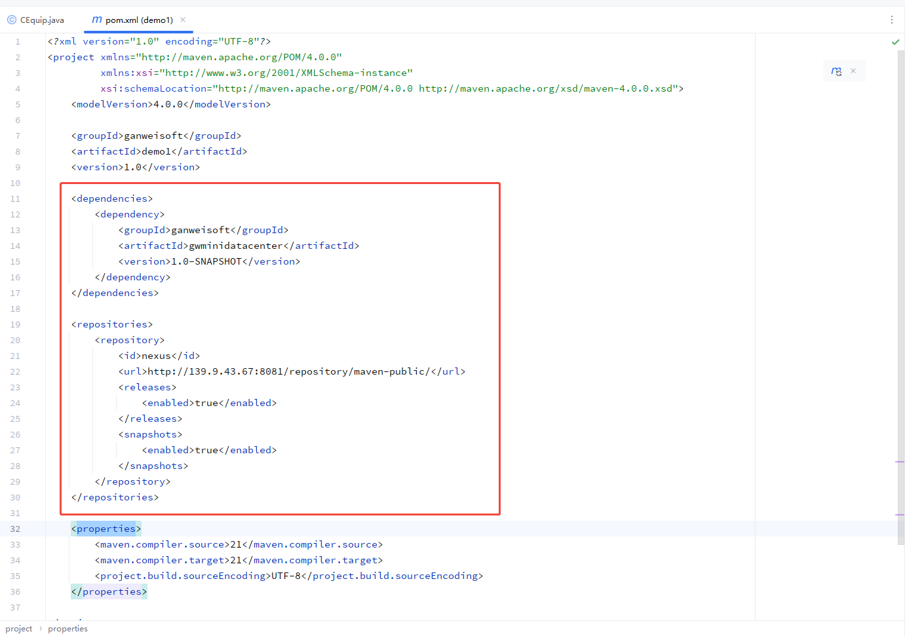

<CopyCodeComponent/>

## java协议插件开发

### 一、环境配置

#### JDK环境准备

**1. 下载与安装**

<details class="custom-block details" open> 

<summary>详情</summary>

- 推荐使用 **Microsoft Build of OpenJDK 21**（适配Windows/Linux/macOS）

- 官方下载地址：https://learn.microsoft.com/zh-cn/java/openjdk/download

- 验证安装：

  ```bash
  java -version  # 应显示 "21.x.x" 版本信息
  ```

</details>

**2. 环境变量配置（可选）**

<details class="custom-block details" open> 

<summary>详情</summary>

- 若需全局使用，将 `JAVA_HOME` 设为安装路径（如 `C:\Program Files\Eclipse Adoptium\jdk-21.0.2+9`）
- 将 `%JAVA_HOME%\bin` 添加至 `PATH` 变量

</details>

#### Maven配置优化

<details class="custom-block details" open> 

<summary>详情</summary>


**1. 配置文件定位**

- 独立安装Maven：
  - 文件路径：`<Maven安装目录>/conf/settings.xml`
- IntelliJ IDEA集成环境：
  - 文件路径：`<IDEA安装目录>\plugins\maven\lib\maven3\conf\settings.xml`

 **2. settings.xml配置内容添加内容如下**

```xml

<!--在servers节点下-->
<server>
    <id>ganweisoft</id>
    <username>ganweimaven</username>
    <password>ganwei2025</password>
</server>


<!--在mirrors节点下-->
<mirror>
    <id>ganweisoft</id>
    <name>ganweisoft repository</name>
    <url>https://nuget.ganweicloud.com/maven/maven-public/</url>
    <mirrorOf>*</mirrorOf>
</mirror>

<!--在profiles节点下-->
<profile>
    <id>ganweisoft</id>
    <repositories>
        <repository>
            <id>ganweisoft</id>
            <url>https://nuget.ganweicloud.com/maven/maven-public/</url>
            <releases>
                <enabled>true</enabled>
            </releases>
            <snapshots>
                <enabled>true</enabled>
            </snapshots>
        </repository>
    </repositories>
    <pluginRepositories>
        <pluginRepository>
            <id>public</id>
            <name>Public Repositories</name>
            <url>https://nuget.ganweicloud.com/maven/maven-public/</url>
            <releases>
                <enabled>true</enabled>
            </releases>
            <snapshots>
                <enabled>true</enabled>
            </snapshots>
        </pluginRepository>
    </pluginRepositories>
</profile>

<!--在activeProfiles节点下-->
  <activeProfiles>
    <activeProfile>ganweisoft</activeProfile>
  </activeProfiles>

```

**3. 权限与操作规范**

- ⚠️ **管理员权限要求**：
  Windows系统需右键选择"以管理员身份运行"文本编辑器进行修改

- **安全建议**：修改前备份原文件

- 配置：

  ```bash
  mvn help:effective-settings  # 查看生效配置
  ```
</details>

### 二、项目设置

<details class="custom-block details" open> 

<summary>详情</summary>

1. 创建一个maven项目，项目设置使用已配置好的maven配置setting.xml


2. 导入依赖。在项目的pom.xml文件增加如下节点

```
<!--在dependencies节点下-->
<dependencies>
    <dependency>
        <groupId>ganweisoft</groupId>
        <artifactId>gwminidatacenter</artifactId>
        <version>1.0</version>
    </dependency>
</dependencies>

<!--在repositories节点下-->
<repositories>
    <repository>
        <id>nexus</id>
        <url>https://nuget.ganweicloud.com/maven/maven-public/</url>
        <releases>
            <enabled>true</enabled>
        </releases>
        <snapshots>
            <enabled>true</enabled>
        </snapshots>
    </repository>
</repositories>
```



</details>

### 三、类结构规范

<details class="custom-block details" open> 

<summary>详情</summary>

- 精确命名要求，类名必须严格匹配`CEquip`（区分大小写）
- 建议使用IDE的"Rename"重构功能确保全项目引用一致性


</details>

4、随机数代码示例

<details class="custom-block details" open> 

<summary>详情</summary>

```java
package ganweisoft;

import gwdatacenter.*;
import gwdatacenter.database.*;

import java.util.Random;


public class CEquip extends CEquipBase
{
    public CEquip() {
        // 初始化代码（如果有需要）
    }

    /**
     获取设备数据

     @return
     */
    private int iCounttemp = 0;
    @Override
    public CommunicationState GetData(CEquipBase pEquip)
    {
        Sleep(1000);
        if (super.getRunSetParmFlag())
        {
            return CommunicationState.setreturn;
        }

        CommunicationState commState = super.GetData(pEquip);
        if (!commState.equals(CommunicationState.ok))
        {
            return CommunicationState.ok;
        }

        if (!pEquip.GetEvent())
        {
            return CommunicationState.fail;
        }
        return CommunicationState.ok;
    }

    @Override
    public boolean GetYC(YcpTableRow r)
    {
        super.SetYCData(r, new Random().nextDouble());
        return true;
    }

    @Override
    public boolean GetYX(YxpTableRow r)
    {
        super.SetYXData(r, new Random().nextBoolean());
        return true;
    }

    //模拟一些数据
    @Override
    public boolean SetParm(String MainInstruct, String MinorInstruct, String Value)
    {
        try
        {
            if (MainInstruct.equalsIgnoreCase("SetYCYXValue")) //可以强制设置YCYX的值
            {
                if (MinorInstruct.length() > 2) //e.g. MinorInstruct=C_2 0r X_15
                {
                    if (sharpSystem.StringHelper.isNullOrEmpty(Value))
                    {
                        return false;
                    }
                    int ycyxno = Integer.parseInt(MinorInstruct.substring(2));
                    if (ycyxno > 0)
                    {
                        if (MinorInstruct.charAt(0) == 'C' || MinorInstruct.charAt(0) == 'c') //表示设置YC值
                        {
                            getYCResults().put(ycyxno, Double.parseDouble(Value));
                            return true;
                        }
                        if (MinorInstruct.charAt(0) == 'X' || MinorInstruct.charAt(0) == 'x') //表示设置YX值
                        {
                            getYXResults().put(ycyxno, Integer.parseInt(Value) > 0);
                            return true;
                        }
                    }
                }
            }

            return false;
        }
        catch (RuntimeException e)
        {
            DataCenter.WriteLogFile(e.toString());
            return false;
        }
    }
}
```
</details>

### 四、 编译&打包  

<details class="custom-block details" open> 

<summary>详情</summary>

右击选择 运行Maven构建


**可选：已安装Maven时运行下述命令行语句**

```
mvn clean compile jar:jar
```

</details>

### 五、打包镜像

<details class="custom-block details" open> 

<summary>详情</summary>

将打包输出的jar文件替换到下列目录下的dll目录里面

1、目录层级

```
├─bin
│  │  gwminidatacenter.jar
│  │
│  ├─config
│  │      config.properties
│  │
│  └─lib
│          comm-1.0.0.jar
│          jackson-annotations-2.13.5.jar
│          jackson-core-2.13.5.jar
│          jackson-databind-2.13.5.jar
│          jackson-dataformat-xml-2.13.5.jar
│          jackson-datatype-jdk8-2.13.5.jar
│          jackson-datatype-jsr310-2.13.5.jar
│          org.eclipse.paho.client.mqttv3-1.2.5.jar
│          stax2-api-4.2.1.jar
│          woodstox-core-6.4.0.jar
│
├─dll
│      BCDataSimu.STD.jar
│
└─log
        XLog.txt


```

2、配置变量导入

**可选：1、使用环境变量，此时可使用set（windows）或者export（Linux）先初始化后，再调用运行命令**

```
set InstanceId=20250304
set MqUsername=gateway
set MqPassword=********
set MqServer=127.0.0.1
set MqPort=1883
```

**可选：2、使用配置文件。下载方式见下文：IoTCenter 边缘网关部署 -> 应用管理 -> 下载文件。将配置文件放于bin/config文件夹下**


本地执行（windows环境）在bin目录下执行命令（附上截图）


```
java -jar gwminidatacenter-1.0.jar
```


3、打包Docker镜像包

Dockerfile
```Dockerfile
# Example using MS Build of OpenJDK image directly
FROM mcr.microsoft.com/openjdk/jdk:21-ubuntu

# Continue with your application deployment
RUN mkdir /opt/ganwei
COPY IoTCenter.Java /opt/ganwei/IoTCenter.Java

WORKDIR /opt/ganwei/IoTCenter.Java/bin/

CMD ["java", "-jar", "gwminidatacenter.jar"]
```

最后输出的文件为一个tar包如下图


</details>

## **IoTCenter 边缘网关部署**

### 一、必备插件安装

<details class="custom-block details" open> 

<summary>详情</summary>

1、边缘网关平台子设备插件

2、边缘网关平台扩展服务

3、边缘网关

4、设备列表(新版)

安装完成上述插件后重启平台。


</details>

### 二、添加边缘应用

<details class="custom-block details" open> 

<summary>详情</summary>

1、编辑平台信息，MQTT服务填写本地ip端口默认为1883

2、点击测试查看是否连接成功。


</details>

### 三、网关注册

<details class="custom-block details" open> 

<summary>详情</summary>

1、添加网关（网关名称请不要用中文字符）

2、点击安装

3、复制命令到linux环境并回车

4、下载中等待安装完成

5、安装成功后刷新页面。状态会改为已安装。


</details>

### 四、应用管理

<details class="custom-block details" open> 

<summary>详情</summary>

1、添加应用


给应用添加版本，参数参考如下截图，当前版本只支持容器部署。


完成上述步骤后该应用状态为**运行中**

下面需要更新配置文件，使数据通讯正常。

1、下载文件


2、将文件放入部署的环境的映射目录/var/gwminidata/config/（如果不存在该目录请先创建）然后重启 iotagent-java:1.0.3镜像

```
docker restart cc264ea407b9
```


</details>

### 五、数据同步

<details class="custom-block details" open> 

<summary>详情</summary>

1、 配置设备的通讯端口（下级实例标识）和设备属性（JAVA|BCDataSimu.STD），设备驱动库：GW.MqttGatewayServer.Subscribe.STD.dll
注：BCDataSimu.STD 为协议插件名


2、同步设备


3、查看实时值


</details>

## 常见问题

<details class="custom-block details" open> 

<summary>详情</summary>

1. 下面问题及解决方法


**解决方法:JDK版本不对**

2. 下面报错


**MQTT服务端未连接成功**

3. 数据为***
检查下列必备插件插件是否均为最新版本、配置文件是否已替换并重启镜像。

- 边缘网关平台子设备插件

- 边缘网关平台扩展服务

- 边缘网关

- 设备列表(新版)

</details>